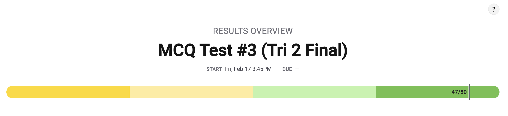
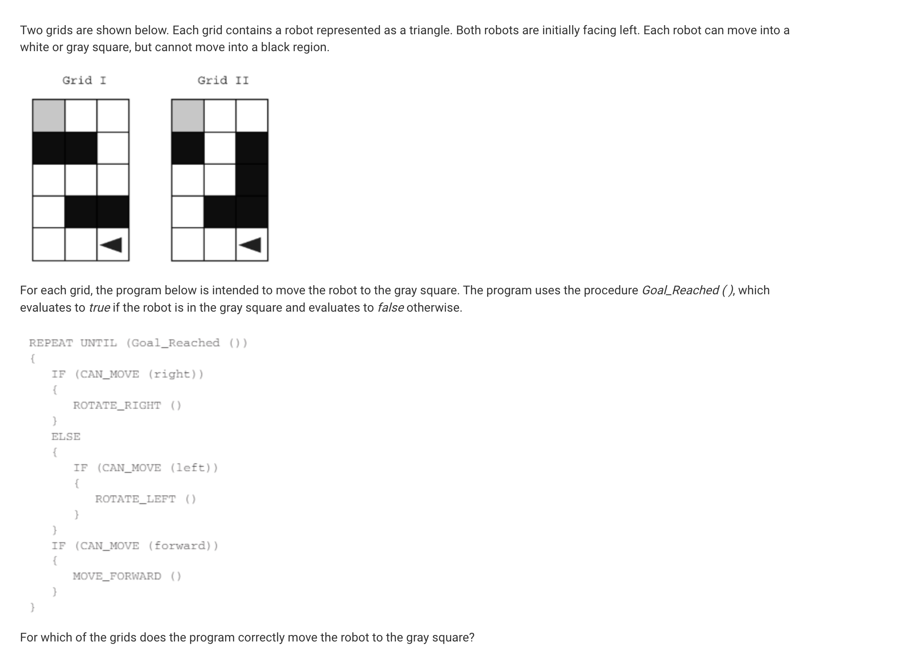
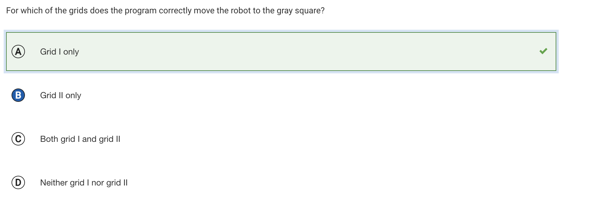
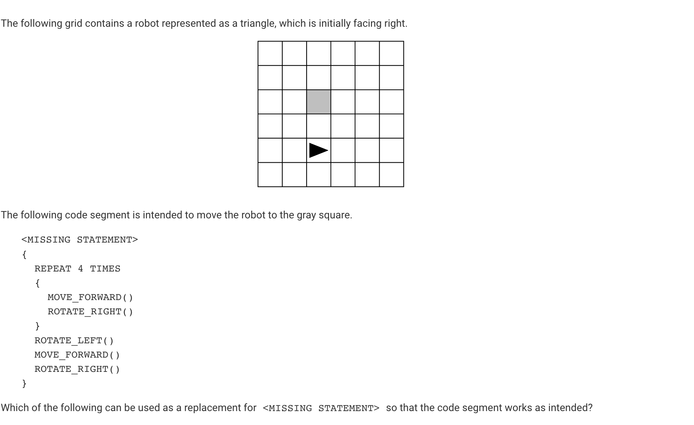
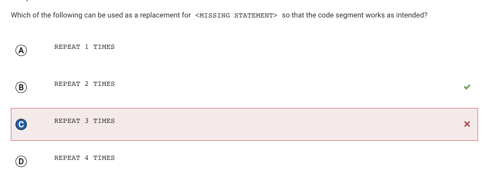
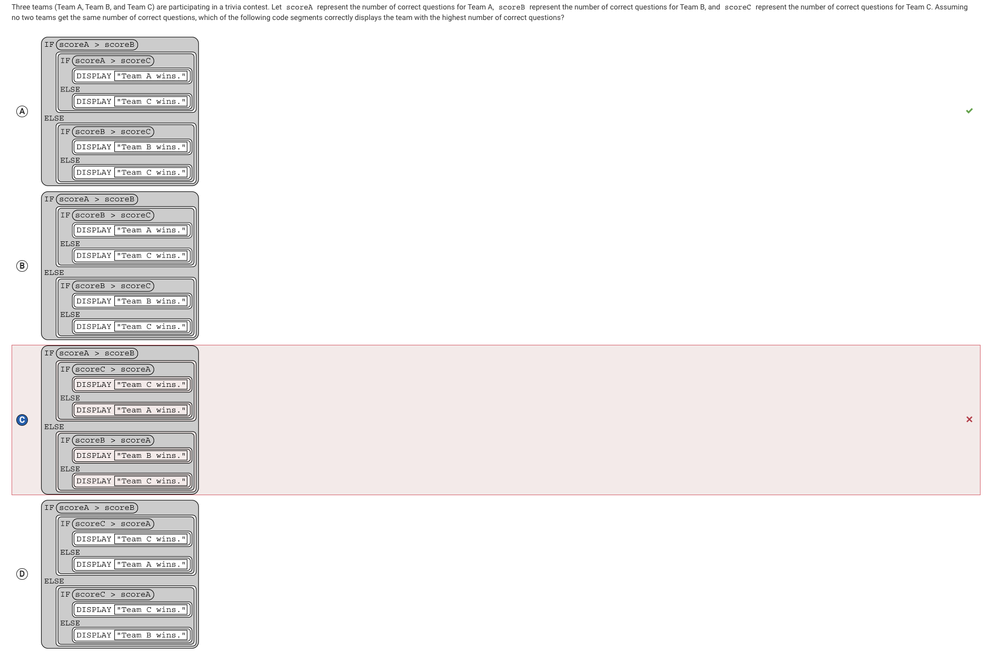

>
# My score 
## Overall Score: 94%

# Overall Reflection
- I found that when I spend more time analyzing each question, I do better on these types of quizzes. Every question that I got wrong werent anything too conceptual, but silly mistakes. 

 

# Question 22 

 
 

## Answer explanation
Here I chose choice B, while the answer was choice A. You can see, the code iterates in a way that if the arrow can rotate right, it will rotate right. Then, if the arrow can rotate left, it will rotate left. Finally, if the arrow can rotate forward, it will rotate forward. With grid I, it will rotate forward until it hits the side, rotate right twice, and go down until it hits the middle row, then it will rotate right and go forward. After that, it will rotate left and go until it reaches the top row. After, it will rotate left until it hits the destination. 

## Why did I get this wrong
I simple terms, I rushed this question and did not evaluate option A. I evaluated option B and made an error in my judgement

 
 

# Question 33 

## Answer explanation and why I got it wrong

 
 

Here, I chose choice C when the correct answer was choice A. The code segment moves it right, forward, left, forward, and right. It does that 4 times. When I was going thru the steps in my head, it seemed correct that it would go thru 3 times. When I looked at it again just now, I saw that it would only need to repeat twice and repeating it 3 times would leave it three rows above its starting position and one row above the gray square.

 
 

# Question 35

 

## Answer explanation and why I got it wrong

I picked choice C, when instead I should have picked choice A. The reason I got this incorrect was that I rushed thru this question and did not consider the other choices. Choice A is correct, because if team A has more points than team B, they win. If the first condition is wrong, that mean team B has more points and if team B has more points than team C, they win. If with the else statement, if Team C has more points than A and B, then they win. 

>